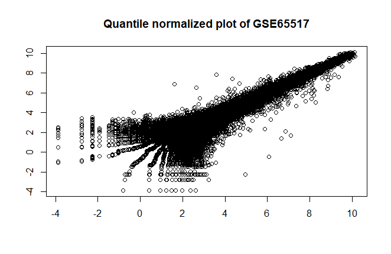

# `BCB420.2019.STRING`

#### (STRING data annotatation of human genes)

&nbsp;

###### Chantal Ho

----

## 1 About this package:

This package describes the workflow to download disease datasets from [the GEO database](https://www.ncbi.nlm.nih.gov/geo/), how to map the IDs to [HGNC](https://www.genenames.org/) symbols, and how to annotate the example gene set.

&nbsp;

#### In this project ...

```text
 --BCB420.2019.GEO/
   |__.gitignore
   |__.Rbuildignore
   |__BCB420.2019.GEO.Rproj
   |__DESCRIPTION
   |__dev/
      |__toBrowser.R               # display .md files in your browser
   |__inst/
      |__extdata/
         |__ilmn2hugo.RData         # ILMN ID to HGNC symbol mapping tool
      |__img/
         |__[...]                  # image sources for .md document
      |__scripts/
         |__recoverIDs.R           # utility to use biomaRt for ID mapping
   |__LICENSE
   |__NAMESPACE
   |__R/
   |__README.md                    # this file

```

&nbsp;

----

## Preparations: packages, functions, files

To begin, we need to make sure the required packages are installed:

```R
if (! require(GEOquery, quietly=TRUE)) {
  if (! exists("biocLite")) {
    source("https://bioconductor.org/biocLite.R")
  }
  biocLite("GEOquery")
  library(GEOquery)
}

if (! requireNamespace("BiocManager", quietly = TRUE)) {
  install.packages("BiocManager")
}

if (! requireNamespace("biomaRt", quietly = TRUE)) {
  BiocManager::install("biomaRt")
  library(biomaRt)
}

if (! require(preprocessCore, quietly=TRUE)) {
  if (! exists("biocLite")) {
    source("https://bioconductor.org/biocLite.R")
  }
  biocLite("preprocessCore")
  library(preprocessCore)
}
```

## Data download and cleanup

You can either download datasets manually from the websites:

1) From https://www.ncbi.nlm.nih.gov/gds/, search "disease and illumina" to get disease datasets with illumina ids

2) Click on the GSE id, which leads you to a webpage where you select Donwload Series Matrix TXT files

3) Put the file into the folder "../data"

4) Call getGEO

```R
# get the expression set for each dataset - here's an example
GSE65517 <- getGEO(filename='../data/GSE65517_series_matrix.txt.gz', GSEMatrix=TRUE, AnnotGPL=TRUE)
```

Or, download datasets directly using getGEO() on the GSE reference ID.

```R
# Vector of all 20 series IDs
datasets <- c("GSE65517", "GSE51843", "GSE54536", "GSE66486", "GSE61853", "GSE33463", "GSE54681", "GSE52509", "GSE27411", "GSE45484", "GSE31413", "GSE48556", "GSE44901",
              "GSE44592", "GSE56570", "GSE45331", "GSE46671", "GSE47598", "GSE25101", "GSE51329")

# making sure I didn't include a duplicate
length(unique(datasets))
```

## Mapping tool 

First, I'm compiling all the data into expression sets. This makes it easy for me to use biomaRt to then map everything with the ids.
``` R
# compiling into a vector of expression sets
exprSets <- c()
for (set in datasets) {
  exprSets <- c(exprSets, getGEO(set, GSEMatrix=TRUE, AnnotGPL=TRUE))
}

# getting the illumina ids
all_probe_ids <- c()
for (set in exprSets){
  all_probe_ids <- c(all_probe_ids, rownames(exprs(set)))
}

# the set is 706,413 elements long. Gonna unique this...
all_probe_ids <- unique(all_probe_ids)

# down to 133,920 elements. Much more doable.

```
A quick call of exprs() on any of the expression sets gives me illumina ids, or ILMN ids. I'll map using the illumina and the hgnc attributes, as well as ensembl ids just in case.

```R
# now to run biomart

ensembl <- useMart("ensembl", dataset="hsapiens_gene_ensembl")

# get the biomart for illumina to hugo
bm <- getBM(attributes=c("illumina_humanht_12_v4", "hgnc_symbol", "ensembl_id"),
            filters = "illumina_humanht_12_v4",
            values = all_probe_ids,
            mart = ensembl)


# taking a look at the table
head(bm)

# counting the number of rows are in the table: 45,654 rows compared to 133,920 probe ids
nrow(bm)
```

## Cleaning up the mapping tool
There are duplicates, ensembl ids that we don't need, and empty strings that we need to change to NAs. We take out the duplicates, remove the ensembl id column, and change the empty strings, and then we can make the mapping tool - a named vector of characters.

```R
# removing ensembl ids
bm_ilmn_hgnc <- bm[,1:2]

# taking out the duplicate rows
unique_bm <- unique(bm_ilmn_hgnc)

# clear out the "" to NA
sel <- which(unique_bm$hgnc_symbol == "") # 4253
unique_bm$hgnc_symbol[sel] <- NA

# taking out the duplicated ids and observing
dup_ilmn <- unique_bm$illumina_humanht_12_v4[duplicated(unique_bm$illumina_humanht_12_v4)] # 7212 duplicates...
tmp <- unique_bm[unique_bm$illumina_humanht_12_v4 %in% dup_ilmn, ]

# taking out duplicates
undup_bm <- unique_bm[!duplicated(unique_bm$illumina_humanht_12_v4),] #38442 rows


# making a mapping tool
ilmn2hugo<- undup_bm$hgnc_symbol
names(ilmn2hugo) <- undup_bm$illumina_humanht_12_v4

head(ilmn2hugo)

# save the map
save(ilmn2hugo, file = file.path("inst", "extdata", "ilmn2hugo.RData"))

```

## Quantile normalization
For each expression set, I quantile normalize based on control and test. Here's an example with GSE65517. You can repeat this for all 20 datasets.

```R
GSE65517$title
# > GSE65517$title
# [1] Primary human monocytes from patient with metastatic breast cancer #1 Primary human monocytes from patient with metastatic breast cancer #2
# [3] Primary human monocytes from patient with metastatic breast cancer #3 Primary human monocytes from patient with metastatic breast cancer #4
# [5] Primary human monocytes from healthy control #1                       Primary human monocytes from healthy control #2
# [7] Primary human monocytes from healthy control #3                       Primary human monocytes from patient with gram-negative sepsis #1
# [9] Primary human monocytes from patient with gram-negative sepsis #2     Primary human monocytes from patient with gram-negative sepsis #3
# [11] Primary human monocytes from patient with tuberculosis #1             Primary human monocytes from patient with tuberculosis #2
# [13] Primary human monocytes from patient with tuberculosis #3

# columns 5, 6, 7 are controls
exprsGSE65517 <- exprs(GSE65517)

# normalizing quantiles
exprsGSE65517[ , 5:7] <- normalize.quantiles(exprsGSE65517[ , 5:7], copy = FALSE)
exprsGSE65517[ , c(1:4, 8:13)] <- normalize.quantiles(exprsGSE65517[ , c(1:4, 8:13)], copy = FALSE)
head(exprsGSE65517)

# plotting the qq plot
plot(log(exprsGSE65517), 
     main="Quantile normalized plot of GSE65517",
     xlab="", ylab="")

```


## Annotating with the sample gene set
Taking the sample gene set from the BCB420 Resources, as well the HGNC table, I annotated the sample gene set with my mapping tool. The annotation is also saved in extdata.

```R
# load everything we need
load("inst/extdata/ilmn2hugo.RData")
myURL <- paste0("https://github.com/hyginn/",
                "BCB420-2019-resources/blob/master/HGNC.RData?raw=true")
load(url(myURL))  # loads HGNC data frame

xSet <- c("AMBRA1", "ATG14", "ATP2A1", "ATP2A2", "ATP2A3", "BECN1", "BECN2",
          "BIRC6", "BLOC1S1", "BLOC1S2", "BORCS5", "BORCS6", "BORCS7",
          "BORCS8", "CACNA1A", "CALCOCO2", "CTTN", "DCTN1", "EPG5", "GABARAP",
          "GABARAPL1", "GABARAPL2", "HDAC6", "HSPB8", "INPP5E", "IRGM",
          "KXD1", "LAMP1", "LAMP2", "LAMP3", "LAMP5", "MAP1LC3A", "MAP1LC3B",
          "MAP1LC3C", "MGRN1", "MYO1C", "MYO6", "NAPA", "NSF", "OPTN",
          "OSBPL1A", "PI4K2A", "PIK3C3", "PLEKHM1", "PSEN1", "RAB20", "RAB21",
          "RAB29", "RAB34", "RAB39A", "RAB7A", "RAB7B", "RPTOR", "RUBCN",
          "RUBCNL", "SNAP29", "SNAP47", "SNAPIN", "SPG11", "STX17", "STX6",
          "SYT7", "TARDBP", "TFEB", "TGM2", "TIFA", "TMEM175", "TOM1",
          "TPCN1", "TPCN2", "TPPP", "TXNIP", "UVRAG", "VAMP3", "VAMP7",
          "VAMP8", "VAPA", "VPS11", "VPS16", "VPS18", "VPS33A", "VPS39",
          "VPS41", "VTI1B", "YKT6")

# find which genes from xSet are not in the mapping tool

x <- which( ! (xSet %in% ilmn2hugo))
cat(sprintf("\t%s\t(%s)\n", HGNC[xSet[x], "sym"], HGNC[xSet[x], "name"]))

# 4 genes found that weren't annotated/found in my mapping tool.
#
# BORCS8	(BLOC-1 related complex subunit 8)
# GABARAP	(GABA type A receptor-associated protein)
# LAMP1	(lysosomal associated membrane protein 1)
# VPS33A	(VPS33A, CORVET/HOPS core subunit)

# save annotation to tsv
map <- c()
for (x in xSet){
  map <- c(map, names(ilmn2hugo)[unname(which(ilmn2hugo == x)[1])])
}

df <- data.frame(xSet, map)
colnames(df) <- c("xSet_genes", "ilmn_ids")
write.table(df, file="inst/extdata/annotated.tsv", row.names = F)

```
